# ETL Completion Signal Architecture for TrustRails

## Executive Summary

The TrustRails application currently suffers from inconsistent analytics updates where monthly analytics cards update at different times after a transfer completes. Volume and average time update immediately via SSE, but completion count takes longer because it depends on ETL processing to update the Data Connect `status` field. This document outlines a consolidated signal solution that provides real-time notification when ETL processing is completely finished.

## Current Architecture Analysis

### Event-Driven Flow Overview

```
Transfer Completion → Firebase Events → ETL Processing → Data Connect → Analytics API → UI Cards
     ↓                      ↓              ↓              ↓              ↓           ↓
  Immediate SSE        Real-time     ETL Delay      Database     Fixed Delay    Card Updates
   Broadcast           Listener      (2-15s)         Write        (5s timeout)   (Staggered)
```

### Current Components and Files

#### 1. **Server-Sent Events (SSE) Infrastructure**
- **`/app/api/events/global-stream/route.ts`** - Global analytics stream for completion events
- **`/app/api/events/rollover-stream/route.ts`** - Rollover-specific events including financial updates
- **`/lib/hooks/useAnalyticsRefresh.ts`** - React hook connecting to SSE for analytics refresh triggers

#### 2. **ETL Pipeline Components**
- **`/etl/functions/index.js`** - Master ETL Orchestrator triggered by `rollover.completed` events
- **`/etl/functions/MASTER-ETL-ORCHESTRATOR.js`** - Atomic ETL processing with Data Connect population
- **`/lib/events/event-service.ts`** - Event service that creates completion events and transfer records

#### 3. **Analytics and UI Components**
- **`/components/rollover/MonthlyStatsCardsTremor.tsx`** - Monthly analytics cards with real-time refresh
- **`/lib/hooks/useRealtimeRefresh.ts`** - Real-time refresh coordination for UI components
- **`/lib/services/data-connect-analytics-service.ts`** - Data Connect analytics queries

#### 4. **Event-Driven Context**
- **`/contexts/EventDrivenRolloverContext.tsx`** - Central state management for rollover operations

### Current Timing Issues

1. **Volume and Average Time**: Update immediately via SSE + Firestore aggregation (~100ms)
2. **Completion Count**: Requires ETL → Data Connect write → API query (~2-15 seconds)
3. **Fixed 5-Second Delay**: `useAnalyticsRefresh.ts` uses hardcoded 5-second timeout that's unreliable

## Current ETL Flow Analysis

### ETL Master Orchestrator Pipeline

```javascript
// /etl/functions/index.js - masterETLOrchestrator
rollover.completed event → ETL Lock → Phase Processing:

Phase 1: Extract rollover data from events
Phase 2: Populate core tables (Transfer, Account, FinancialBreakdown)  
Phase 3: Populate blockchain and token data
Phase 4: Update transfer status to "completed" ← CRITICAL FOR UI
Phase 5: Trigger analytics refresh notification
```

### Critical ETL Completion Points

The ETL process has multiple completion phases, but the UI specifically needs to know when:

1. **Transfer Status Updated** - When `transfer.status = "completed"` in Data Connect
2. **Analytics Tables Updated** - When `AnalyticsTimeSeries` table has fresh aggregations  
3. **All Dependent Tables Populated** - When blockchain, financial, and audit data is complete

## Proposed Solution: Consolidated ETL Completion Signal

### Architecture Overview

```
Transfer Complete → ETL Processing → ETL Completion Event → SSE Broadcast → UI Refresh
                         ↓                    ↓                  ↓            ↓
                    All 12 Tables         ETL Status          Real-time    Coordinated
                     Populated            Verified           Notification   Card Update
```

### Implementation Strategy

#### 1. **ETL Completion Event Creation**

**File**: `/etl/functions/index.js` (Master ETL Orchestrator)

```javascript
// Phase 6: ETL Completion Signal (NEW)
console.log('📊 Phase 6: Creating ETL completion signal...');
await createETLCompletionSignal(rolloverId, transferId, rolloverData);

async function createETLCompletionSignal(rolloverId, transferId, rolloverData) {
  try {
    // Verify all critical tables are populated
    const verification = await verifyETLCompleteness(rolloverId, transferId);
    
    if (!verification.complete) {
      console.warn(`⚠️ ETL incomplete for ${rolloverId}:`, verification.missing);
      return;
    }
    
    // Create completion signal event
    const completionSignalEvent = {
      eventType: 'etl.completed',
      rolloverId: rolloverId,
      userId: 'system-etl',
      timestamp: admin.firestore.FieldValue.serverTimestamp(),
      eventData: {
        transferId: transferId,
        sourceCustodianId: rolloverData.transferData?.sourceCustodianId,
        destinationCustodianId: rolloverData.transferData?.destinationCustodianId,
        tablesPopulated: verification.tablesPopulated,
        processingTimeMs: Date.now() - startTime,
        etlVersion: '2.0.0'
      },
      source: 'master-etl-orchestrator'
    };
    
    // Store completion signal event
    await db.collection('events').add(completionSignalEvent);
    console.log('✅ ETL completion signal created for:', rolloverId);
    
  } catch (error) {
    console.error('❌ Failed to create ETL completion signal:', error);
    throw error;
  }
}

async function verifyETLCompleteness(rolloverId, transferId) {
  const verification = {
    complete: false,
    tablesPopulated: [],
    missing: []
  };
  
  try {
    // Check critical tables in Data Connect
    const verificationQueries = {
      transfer: `
        query VerifyTransfer($rolloverId: String!) {
          transfers(where: { rolloverId: { eq: $rolloverId }, status: { eq: "completed" } }) {
            id
          }
        }
      `,
      analytics: `
        query VerifyAnalytics($custodianId: String!) {
          analyticsTimeSeries(where: { 
            custodianId: { eq: $custodianId }
            granularity: { eq: "monthly" }
          }) {
            id totalCount
          }
        }
      `
    };
    
    // Verify transfer status is "completed"
    const transferResult = await dataConnect.executeGraphql(
      verificationQueries.transfer, 
      { variables: { rolloverId } }
    );
    
    if (transferResult.data.transfers.length > 0) {
      verification.tablesPopulated.push('transfers');
    } else {
      verification.missing.push('transfer_status_completed');
    }
    
    // Verify analytics are updated (check both custodians)
    const custodianIds = [
      rolloverData.transferData?.sourceCustodianId,
      rolloverData.transferData?.destinationCustodianId
    ].filter(Boolean);
    
    for (const custodianId of custodianIds) {
      const analyticsResult = await dataConnect.executeGraphql(
        verificationQueries.analytics,
        { variables: { custodianId } }
      );
      
      if (analyticsResult.data.analyticsTimeSeries.length > 0) {
        verification.tablesPopulated.push(`analytics_${custodianId}`);
      } else {
        verification.missing.push(`analytics_${custodianId}`);
      }
    }
    
    // ETL is complete if no missing components
    verification.complete = verification.missing.length === 0;
    
    return verification;
    
  } catch (error) {
    console.error('❌ ETL verification failed:', error);
    verification.missing.push('verification_error');
    return verification;
  }
}
```

#### 2. **SSE Stream Integration**

**File**: `/app/api/events/global-stream/route.ts`

```javascript
// Add ETL completion events to the listener
const unsubscribe = adminDb!
  .collection('events')
  .where('eventType', 'in', ['rollover.completed', 'etl.completed']) // ADD etl.completed
  .where('timestamp', '>=', connectionStartTime)
  .orderBy('timestamp', 'desc')
  .onSnapshot((snapshot) => {
    snapshot.docChanges().forEach((change) => {
      const eventData = change.doc.data();
      const eventId = change.doc.id;
      
      if (change.type === 'added' && 
          !processedEventIds.has(eventId) && 
          eventTime > connectionTime) {
        
        processedEventIds.add(eventId);
        
        // Handle different event types
        let messageType = 'completion_event';
        if (eventData.eventType === 'rollover.completed') {
          messageType = 'transfer_completed';
        } else if (eventData.eventType === 'etl.completed') {
          messageType = 'etl_completed'; // NEW: ETL completion signal
        }
        
        const message = `data: ${JSON.stringify({
          type: messageType,
          eventType: eventData.eventType,
          rolloverId: eventData.rolloverId,
          transferId: eventData.eventData?.transferId,
          sourceCustodianId: eventData.eventData?.sourceCustodianId,
          destinationCustodianId: eventData.eventData?.destinationCustodianId,
          tablesPopulated: eventData.eventData?.tablesPopulated,
          processingTimeMs: eventData.eventData?.processingTimeMs,
          timestamp: eventData.timestamp?.toDate?.() || eventData.timestamp,
          source: 'global-analytics-stream'
        })}\n\n`;
        
        controller.enqueue(new TextEncoder().encode(message));
      }
    });
  });
```

#### 3. **Analytics Refresh Hook Enhancement**

**File**: `/lib/hooks/useAnalyticsRefresh.ts`

```typescript
// Enhanced analytics refresh with ETL completion awareness
useEffect(() => {
  let abortController: AbortController | null = null;
  let retryCount = 0;
  const maxRetries = 3;
  let retryTimeout: NodeJS.Timeout | null = null;
  
  const connectSSE = async () => {
    try {
      abortController = new AbortController();
      
      const response = await fetch('/api/events/global-stream', {
        method: 'GET',
        credentials: 'include',
        headers: {
          'Cache-Control': 'no-cache',
          'Accept': 'text/event-stream',
        },
        signal: abortController.signal
      });
      
      if (!response.ok) {
        throw new Error(`SSE connection failed: ${response.status}`);
      }
      
      const reader = response.body?.getReader();
      const decoder = new TextDecoder();
      let buffer = '';
      
      while (true) {
        const { done, value } = await reader!.read();
        if (done) break;
        
        buffer += decoder.decode(value, { stream: true });
        const lines = buffer.split('\n');
        buffer = lines.pop() || '';
        
        for (const line of lines) {
          if (line.startsWith('data: ')) {
            try {
              const data = JSON.parse(line.slice(6));
              
              // Handle different completion signals
              if (data.type === 'transfer_completed') {
                console.log('🔄 Transfer completed - waiting for ETL...');
                // Don't refresh immediately - wait for ETL completion
                
              } else if (data.type === 'etl_completed') {
                console.log('✅ ETL completed - refreshing analytics immediately');
                console.log('📊 ETL Details:', {
                  rolloverId: data.rolloverId,
                  processingTime: data.processingTimeMs,
                  tablesPopulated: data.tablesPopulated
                });
                
                // Immediate refresh - no delay needed
                setRefreshTrigger(prev => {
                  const newValue = prev + 1;
                  console.log('📊 ETL completion triggered refresh:', newValue);
                  return newValue;
                });
              }
              
            } catch (error) {
              if (line !== 'data: ') {
                console.warn('Failed to parse SSE event:', line, error);
              }
            }
          }
        }
      }
    } catch (error: any) {
      // Handle errors and retries...
    }
  };
  
  connectSSE();
  
  return () => {
    if (abortController) {
      abortController.abort();
    }
    if (retryTimeout) {
      clearTimeout(retryTimeout);
    }
  };
}, []);
```

#### 4. **Monthly Cards Coordination**

**File**: `/components/rollover/MonthlyStatsCardsTremor.tsx`

```typescript
// Enhanced real-time refresh callback
const handleRealtimeRefresh = useCallback(async () => {
  if (!effectiveCustodianId) return;
  
  console.log('🔄 ETL-triggered refresh for monthly cards');
  
  try {
    const currentMonth = new Date().toISOString().slice(0, 7);
    const url = `/api/analytics/monthly-summary?custodianId=${effectiveCustodianId}&month=${currentMonth}&etlComplete=true`;
    
    const response = await fetch(url, { 
      credentials: 'include',
      cache: 'no-store'
    });
    
    if (response.ok) {
      const data = await response.json();
      console.log('✅ Monthly cards updated with ETL-complete data');
      setMonthlyData(data);
    }
  } catch (error) {
    console.error('Error during ETL-triggered refresh:', error);
  }
}, [effectiveCustodianId]);

// Connect to real-time updates with ETL awareness
useRealtimeRefresh(handleRealtimeRefresh);
```

### Backward Compatibility Strategy

1. **Dual Event Handling**: Support both `rollover.completed` and `etl.completed` events
2. **Fallback Timeout**: Keep 5-second timeout as fallback if ETL completion signal fails
3. **Gradual Migration**: Roll out ETL completion signals alongside existing system
4. **Error Handling**: Graceful degradation if ETL completion verification fails

### Implementation Priority Levels

#### **Priority 1: Critical Path (Week 1)**
- [ ] Add ETL completion signal creation to Master ETL Orchestrator
- [ ] Enhance global SSE stream to broadcast `etl.completed` events
- [ ] Update analytics refresh hook to listen for ETL completion

#### **Priority 2: Integration (Week 2)**  
- [ ] Update monthly cards to use ETL completion triggers
- [ ] Add ETL completion verification queries
- [ ] Implement fallback mechanisms for reliability

#### **Priority 3: Optimization (Week 3)**
- [ ] Add detailed ETL metrics and timing data
- [ ] Create ETL completion monitoring dashboard
- [ ] Optimize ETL verification queries for performance

## Sequence Diagrams

### Current Flow (With Timing Issues)


### Proposed Flow (Coordinated Updates)

```mermaid
sequenceDiagram
    participant User
    participant UI as Monthly Cards
    participant SSE as Global SSE Stream
    participant ETL as ETL Orchestrator
    participant DC as Data Connect
    participant API as Analytics API

    User->>+ETL: Complete Transfer
    ETL->>SSE: rollover.completed event (immediate)
    SSE->>UI: transfer_completed message (100ms)
    UI->>UI: Wait for ETL completion ⏳
    
    Note over ETL,DC: ETL Processing (2-15 seconds)
    ETL->>DC: Update transfer status
    ETL->>DC: Update analytics tables
    ETL->>ETL: Verify ETL completeness ✓
    ETL->>SSE: etl.completed event 🚀
    
    SSE->>UI: etl_completed message (immediate)
    UI->>API: Fetch analytics (no delay)
    API->>DC: Query analytics data
    DC->>API: Return verified fresh data
    API->>UI: Updated metrics ✅
    
    Note over UI: All cards update simultaneously 🎯
```



### ETL Completion Verification Flow

```mermaid
sequenceDiagram
    participant ETL as ETL Orchestrator
    participant DC as Data Connect
    participant Events as Events Collection
    participant SSE as Global SSE Stream

    Note over ETL: Phase 4: Update transfer status
    ETL->>DC: UPDATE transfers SET status='completed'
    
    Note over ETL: Phase 5: Update analytics
    ETL->>DC: UPSERT analyticsTimeSeries
    
    Note over ETL: Phase 6: Verify completion (NEW)
    ETL->>DC: Query transfer status
    DC->>ETL: status='completed' ✓
    ETL->>DC: Query analytics records
    DC->>ETL: Fresh aggregations ✓
    
    ETL->>Events: Create etl.completed event
    Events->>SSE: Real-time listener triggers
    SSE->>SSE: Broadcast to all clients 📡
    
    Note over ETL: ETL marked as completed
    ETL->>Events: Update etl_processed status
```



## Monitoring and Debugging

### ETL Completion Metrics

```javascript
// Add to ETL completion signal event data
const completionMetrics = {
  tablesPopulated: verification.tablesPopulated,
  processingTimeMs: Date.now() - startTime,
  transferId: transferId,
  custodianIds: [sourceCustodianId, destinationCustodianId],
  etlVersion: '2.0.0',
  verificationChecks: {
    transferStatus: verification.transferStatus,
    analyticsUpdated: verification.analyticsUpdated,
    blockchainData: verification.blockchainData
  }
};
```

### Debug Logging Strategy

```javascript
// ETL Orchestrator Debug Logs
console.log(`🚀 ETL START: ${rolloverId} at ${new Date().toISOString()}`);
console.log(`⚡ Phase 4 COMPLETE: Transfer status updated`);
console.log(`📊 Phase 5 COMPLETE: Analytics tables updated`);
console.log(`✅ Phase 6 COMPLETE: ETL completion signal sent`);

// Analytics Refresh Debug Logs
console.log(`🔄 TRANSFER_COMPLETED: Waiting for ETL completion...`);
console.log(`⚡ ETL_COMPLETED: Immediate refresh triggered`);
console.log(`📊 ANALYTICS_UPDATED: All cards refreshed simultaneously`);
```

### Monitoring Dashboard Queries

```graphql
# Monitor ETL completion events
query ETLCompletionEvents($hours: Int!) {
  events(where: { 
    eventType: { eq: "etl.completed" }
    timestamp: { ge: $hoursAgo }
  }) {
    rolloverId
    timestamp
    eventData
  }
}

# Monitor ETL processing times
query ETLPerformanceMetrics($custodianId: String!) {
  events(where: {
    eventType: { eq: "etl.completed" }
    custodianId: { eq: $custodianId }
  }) {
    rolloverId
    eventData # Contains processingTimeMs
    timestamp
  }
}
```

## Testing Strategy

### Integration Test Plan

```typescript
describe('ETL Completion Signal Integration', () => {
  it('should create ETL completion signal after all tables populated', async () => {
    // 1. Trigger rollover completion
    const rolloverId = 'test-rollover-123';
    await triggerRolloverCompletion(rolloverId);
    
    // 2. Wait for ETL processing
    await waitForETLProcessing(rolloverId, 30000); // 30 second timeout
    
    // 3. Verify ETL completion event exists
    const completionEvent = await getETLCompletionEvent(rolloverId);
    expect(completionEvent).toBeDefined();
    expect(completionEvent.eventType).toBe('etl.completed');
    expect(completionEvent.eventData.tablesPopulated).toContain('transfers');
    
    // 4. Verify Data Connect tables are populated
    const transfer = await queryTransfer(rolloverId);
    expect(transfer.status).toBe('completed');
    
    // 5. Verify SSE broadcast occurred
    const sseMessages = await captureSSEMessages('/api/events/global-stream');
    const etlMessage = sseMessages.find(m => m.type === 'etl_completed');
    expect(etlMessage).toBeDefined();
    expect(etlMessage.rolloverId).toBe(rolloverId);
  });
  
  it('should handle ETL completion signal failure gracefully', async () => {
    // Test fallback to 5-second timeout when ETL signal fails
  });
  
  it('should coordinate monthly cards update timing', async () => {
    // Test that all three cards update simultaneously
  });
});
```

### Performance Testing

```javascript
// ETL Completion Signal Performance Benchmark
const benchmarkETLCompletion = async (rolloverId) => {
  const startTime = Date.now();
  
  // Trigger completion
  await triggerRolloverCompletion(rolloverId);
  
  // Measure time to ETL completion signal
  const completionSignalTime = await waitForETLCompletionSignal(rolloverId);
  const etlLatency = completionSignalTime - startTime;
  
  // Measure time to UI update
  const uiUpdateTime = await waitForUIRefresh();
  const totalLatency = uiUpdateTime - startTime;
  
  return {
    etlLatency,
    totalLatency,
    improvement: BASELINE_LATENCY - totalLatency
  };
};
```

## Migration Plan

### Phase 1: Infrastructure (Week 1)
1. **ETL Enhancement**: Add completion signal creation to Master ETL Orchestrator
2. **SSE Integration**: Update global stream to handle `etl.completed` events
3. **Event Verification**: Add ETL completeness verification queries

### Phase 2: UI Integration (Week 2)
1. **Analytics Hook**: Update `useAnalyticsRefresh` for ETL completion awareness
2. **Monthly Cards**: Coordinate card updates with ETL completion signals
3. **Testing**: Comprehensive integration testing with real completion scenarios

### Phase 3: Optimization (Week 3)
1. **Performance Monitoring**: Add detailed ETL completion metrics
2. **Fallback Logic**: Robust error handling and timeout fallbacks
3. **Documentation**: Update API documentation and troubleshooting guides

### Phase 4: Production Rollout (Week 4)
1. **Gradual Deployment**: Feature flag controlled rollout
2. **Monitoring**: Real-time monitoring of ETL completion signal performance
3. **Cleanup**: Remove legacy 5-second timeouts after validation

## Expected Outcomes

### Performance Improvements
- **Immediate Response**: Cards update within 100ms of ETL completion
- **Consistency**: All analytics components update simultaneously  
- **Reliability**: No more staggered updates or timeout issues
- **User Experience**: Smooth, coordinated dashboard updates

### Technical Benefits
- **Deterministic Updates**: UI refreshes based on actual ETL completion
- **Reduced Server Load**: Eliminate unnecessary polling and premature API calls
- **Better Observability**: Clear visibility into ETL processing pipeline
- **Scalable Architecture**: Foundation for future real-time dashboard features

### Business Impact
- **Improved User Trust**: Consistent, reliable analytics display
- **Reduced Support Issues**: Eliminate user confusion about staggered updates
- **Better Data Accuracy**: Ensure UI shows complete, processed data
- **Platform Reliability**: More robust real-time analytics foundation

## Conclusion

The ETL Completion Signal Architecture provides a sophisticated solution to the current analytics refresh timing issues in TrustRails. By creating deterministic signals when ETL processing is truly complete, we can coordinate UI updates to provide users with immediate, accurate, and synchronized analytics displays.

This approach builds upon the existing robust SSE infrastructure while adding the precision needed for enterprise-grade real-time analytics. The solution maintains backward compatibility while providing a clear migration path to more reliable and performant analytics updates.

The implementation prioritizes reliability and user experience, ensuring that analytics cards update together with verified fresh data rather than at arbitrary time intervals. This creates a more professional and trustworthy platform experience that aligns with TrustRails' commitment to transparency and accuracy in financial data presentation.