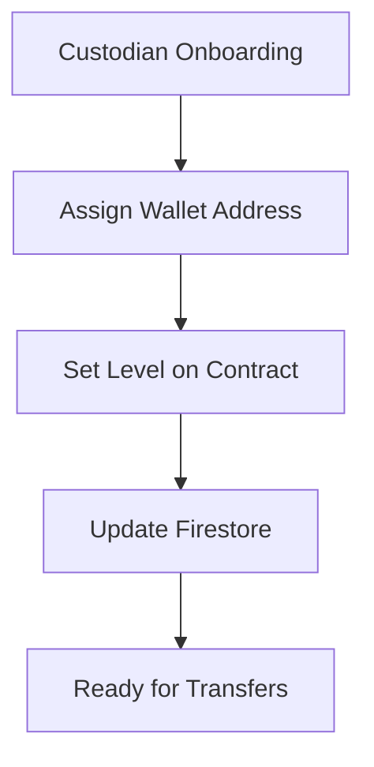

# Programmatic Custodian Level Management

## Overview
This document describes how to programmatically manage custodian levels in TrustRails, enabling automatic upgrades from Level 2 (ACH) to Level 3 (Tokenized) transfers.

## Architecture

### Two-Layer Configuration
Custodian levels must be set in TWO places:
1. **Blockchain Contract** - Authoritative source for auto-mint/burn logic
2. **Firestore Database** - For UI display and business logic



## Implementation

### 1. Service Class for Level Management

Create `lib/services/custodian-level-manager.ts`:

```typescript
import { ethers } from 'ethers';
import { adminDb } from '@/lib/firebase-admin';

export class CustodianLevelManager {
  private provider: ethers.JsonRpcProvider;
  private adminWallet: ethers.Wallet;
  private v6Contract: ethers.Contract;
  
  private readonly V6_CONTRACT_ABI = [
    'function setCustodianLevel(address custodian, uint8 level)',
    'function custodianLevels(address custodian) view returns (uint8)',
    'function hasRole(bytes32 role, address account) view returns (bool)',
    'function DEFAULT_ADMIN_ROLE() view returns (bytes32)'
  ];

  constructor() {
    // Initialize provider based on network
    const rpcUrl = process.env.ARBITRUM_SEPOLIA_RPC_URL || 
                   'https://arb-sepolia.g.alchemy.com/v2/YOUR_KEY';
    this.provider = new ethers.JsonRpcProvider(rpcUrl);
    
    // Initialize admin wallet
    // In production, use secure key management (AWS KMS, Google Secret Manager, etc.)
    const adminKey = process.env.ADMIN_WALLET_PRIVATE_KEY;
    if (!adminKey) {
      throw new Error('Admin wallet key not configured');
    }
    this.adminWallet = new ethers.Wallet(adminKey, this.provider);
    
    // Initialize contract
    const v6Address = process.env.NEXT_PUBLIC_ROLLOVER_ESCROW_V5_ADDRESS;
    if (!v6Address) {
      throw new Error('V6 contract address not configured');
    }
    this.v6Contract = new ethers.Contract(v6Address, this.V6_CONTRACT_ABI, this.adminWallet);
  }

  /**
   * Set custodian level on blockchain and in database
   */
  async setCustodianLevel(custodianId: string, level: 1 | 2 | 3): Promise<{
    success: boolean;
    transactionHash?: string;
    error?: string;
  }> {
    try {
      // Step 1: Get custodian wallet address from Firestore
      const custodianDoc = await adminDb.collection('custodians').doc(custodianId).get();
      if (!custodianDoc.exists) {
        return { success: false, error: 'Custodian not found' };
      }

      const custodianData = custodianDoc.data();
      const walletAddress = this.extractWalletAddress(custodianData);
      
      if (!walletAddress) {
        return { success: false, error: 'Custodian has no wallet configured' };
      }

      // Step 2: Check current level on contract
      const currentLevel = await this.v6Contract.custodianLevels(walletAddress);
      
      if (currentLevel === level) {
        // Already at target level, just update database
        await this.updateDatabase(custodianId, level);
        return { success: true };
      }

      // Step 3: Set level on blockchain
      const tx = await this.v6Contract.setCustodianLevel(walletAddress, level);
      const receipt = await tx.wait();

      // Step 4: Update database
      await this.updateDatabase(custodianId, level);

      // Step 5: Log the change for audit
      await this.logLevelChange(custodianId, walletAddress, currentLevel, level, receipt.transactionHash);

      return { 
        success: true, 
        transactionHash: receipt.transactionHash 
      };

    } catch (error) {
      console.error('Error setting custodian level:', error);
      return { 
        success: false, 
        error: error.message || 'Failed to set custodian level' 
      };
    }
  }

  /**
   * Get custodian level from blockchain
   */
  async getCustodianLevel(custodianId: string): Promise<{
    blockchainLevel: number;
    databaseLevel: number;
    walletAddress: string | null;
    synced: boolean;
  }> {
    const custodianDoc = await adminDb.collection('custodians').doc(custodianId).get();
    
    if (!custodianDoc.exists) {
      throw new Error('Custodian not found');
    }

    const custodianData = custodianDoc.data();
    const walletAddress = this.extractWalletAddress(custodianData);
    const databaseLevel = custodianData?.level || 2;

    if (!walletAddress) {
      return {
        blockchainLevel: 0,
        databaseLevel,
        walletAddress: null,
        synced: false
      };
    }

    const blockchainLevel = await this.v6Contract.custodianLevels(walletAddress);
    
    return {
      blockchainLevel: Number(blockchainLevel),
      databaseLevel,
      walletAddress,
      synced: Number(blockchainLevel) === databaseLevel
    };
  }

  /**
   * Bulk set levels for multiple custodians
   */
  async bulkSetCustodianLevels(custodians: Array<{
    custodianId: string;
    level: 1 | 2 | 3;
  }>): Promise<Array<{
    custodianId: string;
    success: boolean;
    transactionHash?: string;
    error?: string;
  }>> {
    const results = [];
    
    for (const { custodianId, level } of custodians) {
      const result = await this.setCustodianLevel(custodianId, level);
      results.push({ custodianId, ...result });
      
      // Add delay to avoid rate limiting
      await new Promise(resolve => setTimeout(resolve, 1000));
    }
    
    return results;
  }

  /**
   * Sync all custodian levels from blockchain to database
   */
  async syncAllLevels(): Promise<{
    synced: number;
    errors: number;
  }> {
    let synced = 0;
    let errors = 0;

    const custodiansSnapshot = await adminDb.collection('custodians').get();
    
    for (const doc of custodiansSnapshot.docs) {
      try {
        const custodianData = doc.data();
        const walletAddress = this.extractWalletAddress(custodianData);
        
        if (walletAddress) {
          const blockchainLevel = await this.v6Contract.custodianLevels(walletAddress);
          
          if (Number(blockchainLevel) !== custodianData.level) {
            await doc.ref.update({
              level: Number(blockchainLevel),
              levelSyncedAt: new Date().toISOString()
            });
            synced++;
          }
        }
      } catch (error) {
        console.error(`Error syncing custodian ${doc.id}:`, error);
        errors++;
      }
    }
    
    return { synced, errors };
  }

  /**
   * Helper: Extract wallet address from custodian data
   */
  private extractWalletAddress(custodianData: any): string | null {
    // Check BYOW configuration first
    if (custodianData?.byowConfiguration?.walletAddress) {
      return custodianData.byowConfiguration.walletAddress;
    }
    
    // Check platform wallet
    if (custodianData?.wallet) {
      if (typeof custodianData.wallet === 'string') {
        return custodianData.wallet;
      }
      if (custodianData.wallet.address) {
        return custodianData.wallet.address;
      }
    }
    
    // Check legacy walletAddress field
    if (custodianData?.walletAddress) {
      return custodianData.walletAddress;
    }
    
    return null;
  }

  /**
   * Helper: Update database with new level
   */
  private async updateDatabase(custodianId: string, level: number): Promise<void> {
    await adminDb.collection('custodians').doc(custodianId).update({
      level,
      levelUpdatedAt: new Date().toISOString(),
      levelUpdatedBy: 'system'
    });
  }

  /**
   * Helper: Log level change for audit trail
   */
  private async logLevelChange(
    custodianId: string,
    walletAddress: string,
    oldLevel: number,
    newLevel: number,
    transactionHash: string
  ): Promise<void> {
    await adminDb.collection('audit_logs').add({
      type: 'custodian_level_change',
      custodianId,
      walletAddress,
      oldLevel,
      newLevel,
      transactionHash,
      network: process.env.NEXT_PUBLIC_DEFAULT_NETWORK || 'arbitrumSepolia',
      timestamp: new Date().toISOString()
    });
  }
}
```

### 2. API Endpoint for Level Management

Create `app/api/custodians/[custodianId]/level/route.ts`:

```typescript
import { NextRequest, NextResponse } from 'next/server';
import { getServerToken } from '@/lib/server-auth';
import { CustodianLevelManager } from '@/lib/services/custodian-level-manager';

export async function GET(
  req: NextRequest,
  { params }: { params: { custodianId: string } }
) {
  try {
    // Verify authentication
    const user = await getServerToken(req);
    if (!user || user.role !== 'admin') {
      return NextResponse.json({ error: 'Unauthorized' }, { status: 401 });
    }

    const manager = new CustodianLevelManager();
    const level = await manager.getCustodianLevel(params.custodianId);
    
    return NextResponse.json(level);
  } catch (error) {
    console.error('Error getting custodian level:', error);
    return NextResponse.json(
      { error: 'Failed to get custodian level' },
      { status: 500 }
    );
  }
}

export async function PUT(
  req: NextRequest,
  { params }: { params: { custodianId: string } }
) {
  try {
    // Verify authentication
    const user = await getServerToken(req);
    if (!user || user.role !== 'admin') {
      return NextResponse.json({ error: 'Unauthorized' }, { status: 401 });
    }

    const body = await req.json();
    const { level } = body;

    if (!level || ![1, 2, 3].includes(level)) {
      return NextResponse.json(
        { error: 'Invalid level. Must be 1, 2, or 3' },
        { status: 400 }
      );
    }

    const manager = new CustodianLevelManager();
    const result = await manager.setCustodianLevel(params.custodianId, level);
    
    if (!result.success) {
      return NextResponse.json(
        { error: result.error },
        { status: 400 }
      );
    }

    return NextResponse.json({
      success: true,
      transactionHash: result.transactionHash,
      message: `Custodian level set to ${level}`
    });
  } catch (error) {
    console.error('Error setting custodian level:', error);
    return NextResponse.json(
      { error: 'Failed to set custodian level' },
      { status: 500 }
    );
  }
}
```

### 3. Automated Level Detection

Create `lib/services/custodian-level-detector.ts`:

```typescript
/**
 * Automatically determine appropriate level based on custodian capabilities
 */
export class CustodianLevelDetector {
  
  /**
   * Analyze custodian and recommend appropriate level
   */
  async recommendLevel(custodianId: string): Promise<{
    recommendedLevel: 1 | 2 | 3;
    reasons: string[];
  }> {
    const custodianDoc = await adminDb.collection('custodians').doc(custodianId).get();
    
    if (!custodianDoc.exists) {
      throw new Error('Custodian not found');
    }

    const data = custodianDoc.data();
    const reasons: string[] = [];
    
    // Check for Level 3 eligibility
    if (this.isEligibleForLevel3(data)) {
      reasons.push('Has blockchain wallet configured');
      reasons.push('Supports real-time settlement');
      reasons.push('Has completed KYC/AML requirements');
      return { recommendedLevel: 3, reasons };
    }
    
    // Default to Level 2
    reasons.push('Standard ACH settlement');
    return { recommendedLevel: 2, reasons };
  }

  private isEligibleForLevel3(custodianData: any): boolean {
    // Must have wallet
    const hasWallet = !!(
      custodianData.wallet || 
      custodianData.walletAddress || 
      custodianData.byowConfiguration?.walletAddress
    );
    
    // Must have completed compliance
    const hasCompliance = custodianData.kycStatus === 'approved';
    
    // Must have opted in for tokenization
    const wantsTokenization = custodianData.enableTokenization === true;
    
    return hasWallet && hasCompliance && wantsTokenization;
  }
}
```

### 4. Integration with Onboarding Flow

```typescript
// In custodian onboarding service
export class CustodianOnboardingService {
  
  async completeCustodianSetup(custodianId: string): Promise<void> {
    // Step 1: Create or assign wallet
    const wallet = await this.assignWallet(custodianId);
    
    // Step 2: Determine appropriate level
    const detector = new CustodianLevelDetector();
    const { recommendedLevel } = await detector.recommendLevel(custodianId);
    
    // Step 3: Set level on blockchain and database
    const manager = new CustodianLevelManager();
    const result = await manager.setCustodianLevel(custodianId, recommendedLevel);
    
    if (!result.success) {
      throw new Error(`Failed to set custodian level: ${result.error}`);
    }
    
    // Step 4: Send notification
    await this.notifyCustodianActivation(custodianId, recommendedLevel);
  }
}
```

### 5. Admin Dashboard Component

```typescript
// components/admin/CustodianLevelManager.tsx
import { useState } from 'react';
import { Button } from '@/components/ui/button';
import { Select } from '@/components/ui/select';

export function CustodianLevelManager({ custodianId }: { custodianId: string }) {
  const [level, setLevel] = useState<number>(2);
  const [loading, setLoading] = useState(false);
  const [status, setStatus] = useState<string>('');

  const updateLevel = async () => {
    setLoading(true);
    setStatus('Updating level on blockchain...');
    
    try {
      const response = await fetch(`/api/custodians/${custodianId}/level`, {
        method: 'PUT',
        headers: { 'Content-Type': 'application/json' },
        body: JSON.stringify({ level })
      });
      
      const data = await response.json();
      
      if (data.success) {
        setStatus(`✅ Level updated to ${level}. TX: ${data.transactionHash}`);
      } else {
        setStatus(`❌ Error: ${data.error}`);
      }
    } catch (error) {
      setStatus(`❌ Failed: ${error.message}`);
    } finally {
      setLoading(false);
    }
  };

  return (
    <div className="p-4 border rounded">
      <h3 className="font-bold mb-2">Custodian Level Management</h3>
      
      <div className="flex gap-2 items-center">
        <Select value={level} onChange={(e) => setLevel(Number(e.target.value))}>
          <option value={2}>Level 2 - ACH Settlement</option>
          <option value={3}>Level 3 - Tokenized (TRUSD)</option>
        </Select>
        
        <Button onClick={updateLevel} disabled={loading}>
          {loading ? 'Updating...' : 'Update Level'}
        </Button>
      </div>
      
      {status && (
        <div className="mt-2 text-sm">{status}</div>
      )}
    </div>
  );
}
```

## Deployment Checklist

### Initial Platform Setup
```javascript
// 1. Deploy contracts
const v6Contract = await deployV6Contract();
const trusdToken = await deployTrusdToken();

// 2. Configure roles
await trusdToken.grantRole(MINTER_ROLE, v6Contract.address);
await trusdToken.grantRole(BURNER_ROLE, v6Contract.address);
await v6Contract.grantRole(PLATFORM_OPERATOR_ROLE, platformWallet);

// 3. Set admin wallet
await v6Contract.grantRole(DEFAULT_ADMIN_ROLE, adminWallet);
```

### Per-Custodian Activation
```javascript
// Automated process
const manager = new CustodianLevelManager();

// Batch upgrade custodians to Level 3
const custodians = [
  { custodianId: 'cust-001', level: 3 },
  { custodianId: 'cust-002', level: 3 },
  { custodianId: 'cust-003', level: 2 } // Stays on ACH
];

const results = await manager.bulkSetCustodianLevels(custodians);
```

## Monitoring & Maintenance

### Health Check Endpoint
```typescript
// app/api/health/custodian-levels/route.ts
export async function GET() {
  const manager = new CustodianLevelManager();
  const syncResult = await manager.syncAllLevels();
  
  return NextResponse.json({
    status: 'ok',
    synced: syncResult.synced,
    errors: syncResult.errors,
    timestamp: new Date().toISOString()
  });
}
```

### Scheduled Sync Job
```javascript
// Run daily to ensure blockchain and database are in sync
cron.schedule('0 0 * * *', async () => {
  const manager = new CustodianLevelManager();
  const result = await manager.syncAllLevels();
  console.log(`Level sync complete: ${result.synced} synced, ${result.errors} errors`);
});
```

## Security Considerations

1. **Admin Key Management**: Use secure key storage (AWS KMS, Google Secret Manager)
2. **Access Control**: Only admins can change levels
3. **Audit Trail**: All changes logged with transaction hashes
4. **Rate Limiting**: Prevent abuse of blockchain calls
5. **Validation**: Verify wallet ownership before level changes

## Error Handling

```typescript
try {
  await manager.setCustodianLevel(custodianId, 3);
} catch (error) {
  if (error.code === 'INSUFFICIENT_FUNDS') {
    // Admin wallet needs ETH
  } else if (error.code === 'UNAUTHORIZED') {
    // Admin wallet lacks permission
  } else if (error.code === 'INVALID_ADDRESS') {
    // Custodian has no wallet
  }
}
```

## Testing

```javascript
// Test level management
describe('CustodianLevelManager', () => {
  it('should set custodian level on blockchain and database', async () => {
    const manager = new CustodianLevelManager();
    const result = await manager.setCustodianLevel('test-custodian', 3);
    
    expect(result.success).toBe(true);
    expect(result.transactionHash).toBeDefined();
    
    // Verify on blockchain
    const level = await manager.getCustodianLevel('test-custodian');
    expect(level.blockchainLevel).toBe(3);
    expect(level.databaseLevel).toBe(3);
    expect(level.synced).toBe(true);
  });
});
```